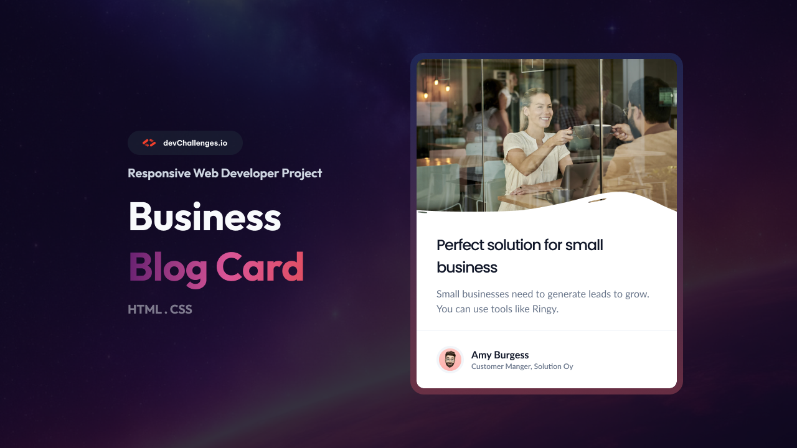

# Business Blog Card

## 📸 Preview

>A modern, responsive business blog card component built with semantic HTML and custom CSS, inspired by a professional design challenge from [devChallenges.io](https://www.devchallenges.io/).


## ✨ Features
- **Modern UI:** Clean, elegant card layout with a wavy SVG overlay for visual separation.
- **Responsive Design:** Optimized for desktop, tablet, and mobile screens.
- **Accessible:** Semantic HTML structure and descriptive alt text for images.
- **Author Section:** Includes avatar, name, and role for a personal touch.
- **Easy Customization:** Straightforward HTML and CSS for quick adaptation to your needs.


## 🚀 Getting Started
1. **Clone or download** this repository.
2. Open `index.html` in your browser to view the card.
3. Edit the HTML and CSS as needed to fit your brand or use case.

## 📁 Project Structure
```
├── index.html
├── README.md
├── thumbnail.jpg
├── design/
│   ├── Desktop_1350px.jpg
│   ├── Mobile_412px.jpg
│   ├── Tablet_1024px.jpg
│   └── white-overlay.svg
├── resources/
│   ├── avatar-image-business-card.png
│   ├── avatar-image-business-card-1.png
│   ├── favicon.ico
│   ├── hero-image.jpg
│   ├── hero-image-1.jpg
│   └── white-overlay.svg
```

---

## 🧠 What I Learned
- Improved my skills in semantic HTML and modern CSS layout techniques (Flexbox, border-radius, box-shadow).
- Practiced building responsive components that adapt to different screen sizes.
- Learned how to use SVG overlays for creative UI effects.
- Enhanced my attention to detail by closely matching a professional design.

## 🔗 Useful Resources
- [MDN Web Docs – HTML & CSS](https://developer.mozilla.org/)
- [CSS Tricks – Flexbox Guide](https://css-tricks.com/snippets/css/a-guide-to-flexbox/)
- [devChallenges.io Community](https://devchallenges.io/)
- [Figma](https://www.figma.com/) – for design inspection and measurement

---


## 👤 Author
Coded by **Ayokanmi Adejola**  
Challenge by [devChallenges.io](https://devchallenges.io/)


